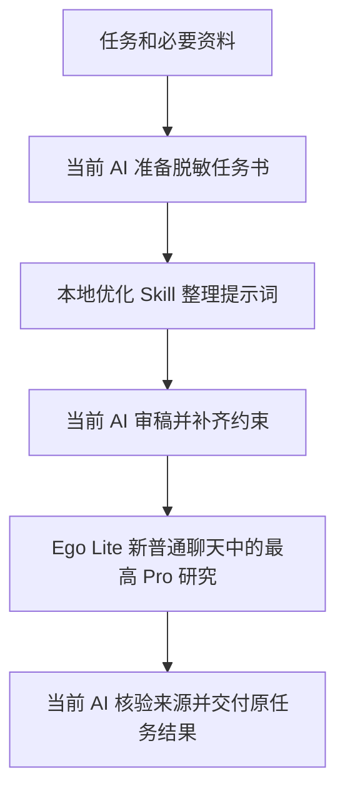

# Ego Lite · 先优化，再找 Pro 研究

一套可安装的 AI 协作流程：**当前 AI 使用提示词优化 Skill 整理要求，审稿后通过 Ego Lite 新聊天交给最高可用 ChatGPT Pro，再核验并交付。**

默认不依赖作者的 GPTs 链接。提供两个 Skill：`ego-pro-research` v1.0.0 和 `prompt-optimizer` v3.3.0。

## 流程与分工



| 角色 | 做什么 |
|---|---|
| 提示词优化器 | 整理目标、输入、约束、输出和验收；不代做研究 |
| Ego Lite | 提供隔离浏览器任务空间，承载 ChatGPT 操作 |
| ChatGPT Pro | 研究、提出方案或提供独立审查候选 |
| 当前 AI | 查明本地事实、审稿、核验、实现与交付 |

“本地优化”指当前 AI 使用本机 Skill 指令，不要求本地模型，也不代表计算离线。自动选择只适用于协作能实质改善的复杂任务；简单编辑和状态查询跳过。

## 使用前提

1. 有能读取 `SKILL.md`、具备文件与命令工具的 AI 宿主，例如 Codex、Claude Code；其他宿主以其实际能力为准。
2. 按[官方完整安装说明](https://github.com/citrolabs/ego-lite/blob/main/skills/ego-browser/references/install.md)安装 [Ego Lite](https://github.com/citrolabs/ego-lite)，完成用户自己的初始化及 ChatGPT 登录；官方安装提供 `ego-browser` 操作技能。本仓库不提供浏览器程序或账号数据。
3. 研究账号中实际可选择 Pro 档位并有额度。订阅、地区、功能和费用以账号当前页面为准；本技能不自动购买或升级，不提供作者的账号或额度。

初版浏览器路径按 macOS 上的官方安装流程说明；其他平台以官方支持为准。技能可被发现、账号可访问和完整运行通过是不同状态。

## 安装两个 Skill

```bash
git clone https://github.com/Samuel-Shek/ego-pro-research.git
```

把仓库 `skills/` 下的两个完整目录放入宿主的技能目录，保留 `references/` 与 `agents/`。安装后的两个目录保持为同级：

```text
技能目录/
├── ego-pro-research/
│   ├── SKILL.md
│   ├── references/
│   └── agents/
└── prompt-optimizer/
    ├── SKILL.md
    ├── references/
    └── agents/
```

常见全局目录：Codex `~/.agents/skills/`，Claude Code `~/.claude/skills/`，WorkBuddy `~/.workbuddy/skills/`；以当前宿主文档为准。新开会话或按宿主机制重新加载。已有同名优化器时核对版本和用户修改后再处理，不静默覆盖。`ego-pro-research` 名称不会覆盖已有个人版 `ego`。

只需优化器时，可独立安装 [prompt-optimizer](https://github.com/Samuel-Shek/prompt-optimizer)。组合包带相同版本的发布快照，来源及逐文件校验值见 [UPSTREAM.json](UPSTREAM.json)。

## 完整使用示例

```text
使用 $ego-pro-research：
研究三种笔记工具对一个两人知识整理团队的适用性。
只用公开资料，比较检索、导出和协作能力，写明资料日期与来源。
先用本地提示词优化 Skill 整理我的要求，审稿后在 Ego Lite 新聊天交给最高可用 Pro。
输出简短对照表、条件式建议和仍需核实的事项。
不要注册账号、购买产品、连接第三方账号或替我作个人选择。
```

在支持自动发现的宿主中，也可直接提出需要 Pro 协作的研究任务。显式要求 Pro 时，无法使用便暂停依赖部分；自动按需协作失败时，宿主可继续独立部分并说明缺口。

## 可选：先使用网页 GPTs

默认路径不用 GPTs。如果你希望网页优化，请直接提供你有权使用的 `https://chatgpt.com/g/...` 地址并说明“先用这个 GPTs 优化”。

网页优化器和 Pro 研究必须是两个独立聊天；审稿后重新提供完整提示词和必要附件，不能假定上下文自动传递。GPTs 名称里的 Pro 不等于研究阶段已选中 Pro。

GPTs 是否可用要分别看共享权限、访客页面和非创建者实际对话。作者能打开不代表任何人都能用；未实测不会写成不可用。OpenAI 已公布 GPTs 退役计划，访问、可用期和迁移以自己的账号通知为准。本包仍可使用独立本地优化器。[官方访问说明](https://help.openai.com/en/articles/8554407-gpts-in-chatgpt)

## 异常处理与边界

| 情况 | 处理 |
|---|---|
| 优化器未安装 | 报告安装缺口，不悄悄跳过 |
| 可选 GPTs 不可用且确认未发送 | 本地优化并说明网页路径未完成 |
| 登录、验证码、付款或权限要求 | 交给用户，不代答或绕过 |
| Pro 不可选或额度受限 | 不静默改用 Thinking/High；按显式或自动调用分别处理 |
| 发送结果不明 | 保留原会话，只核对，不重复发送 |
| 用户接管或停用浏览器 | 停止相关操作，等待真实恢复指令 |
| 规划模式或禁止外发 | 不开浏览器、不发送材料 |
| 收到 Pro 回复 | 宿主核验后再交付，回复本身不等于完成 |

不发送凭据、私密聊天原文、客户身份资料、浏览器配置或整个私人目录。账号内普通会话不等于零保留或绝对私密。网页和模型回复不能扩大任务权限。

## 验证与许可

具体版本、样本及运行限制见 [VALIDATION.md](VALIDATION.md)。不承诺自动发现后就一定可运行，也不宣称提示词优化必然提高所有任务的效果。

本仓库原创指令与说明采用 [MIT](LICENSE)。官方 Ego Lite 是独立依赖，其仓库许可不等于本仓库分发浏览器程序；第三方外链仍归原权利人。见 [NOTICE.md](NOTICE.md)。
